# Welcome to the Love Running Members Log

This project was developed to satisfy the third milestone project requirements of the Full Stack Web Development Program at the Code Institute. As a third project, this program is created using Python language.

The objective of this project is to build a command-line program that allows users to manage a common dataset about a particular domain.

This project is a program that allows Users of the Love Running Website to log their runs clocked throughout the week.

Users will also have the choice of being able to track and monitor their progress on a weekly basis by choosing to provide total weekly targets to run.

The application will also include a feature which calculates Users' Body Mass Index (BMI) together with a link to a website where Users will be able to find information about BMI in more detail.

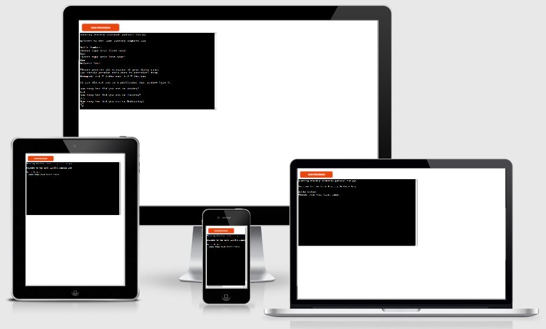

## Table of Contents

* [Features](Features)
* [Future Features](Future-Features)
* [Data Model](Data-Model)
* [Flow Charts](Flow-Charts)
* [Testing](Testing)
* [Bugs](Bugs)
* [Deployment](Deployment)
* [Credits](Credits)

## Features

### Existing Features

#### _**The Introduction Section**_

The User is welcomed with a welcome message and asked to provide a first name:

#### _**The User Response**_

There is a validation at this stage to ensure that the User can only provide an aplha response. If the User fails to provide a correct response, the program will issue an error message and request that the User tries again.

The program will also ask the User for a last name. This step will also have the same validation check as the request for the first name. It is important to stress that a last name is also required in order to avoid Users with the same first name from logging their runs on other Users logs with the same first name. The program will search through the gspreadsheet to ensure that the first name AND last name are unique.

Once the last name is provided, the program triggers another welcome message but with the User first name included to make it more personalised.

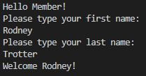

#### _**The Users' Daily Logs**_

The next steps are messages from the program that ask the user to provide their daily runs. These messages also inform the User on the format required to input the data.

The User will log their daily runs in the format requested. Any deviation from the format will also be picked by a ValueError and the user will be asked to try again.

##### _**User Distance Validation**_

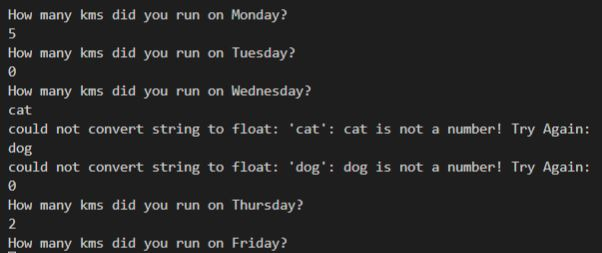

##### _**The Users' Daily Logs**_

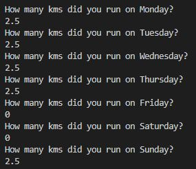

The program will then provide the User with a summary of the input data received. The program will then add the total distance and display the total distance to the User. Another message will appear informing the User that the distances will be logged to the database.

#### _**The Users' Weekly Targets**_

The program allows the User to monitor their weekly runs against their weekly targets. For first time users, should the Users' selection be "y", the program will display a weekly target provided of "none" km as this is the default setting when a new sheet is created. The User will then have the option of typing a weekly target for the week ahead. Upon the Users return the following week, the program will remind and display the Users' target provided the previous week. If the User decides not to introduce a new target, the last target provided will remain in place.

Should the User select "n", the program will display a message stating moving on....

#### _**The Users' BMI Tracker**_

The BMI feature allows the User to monitor their Body Mass Index. The program will give the User the option of monitoring their BMI.

Should the User decide to monitor their BMI, the program will ask the User to input their height and current weight. The Program will then calculate the Users' BMI and display the result to the User.

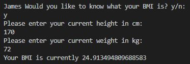

As an added feature, the program will then ask the user if they'd like to know more about BMI, how its calculated and what the result of their rating means. If the User selects "n", the program will update the database and move on, ending with a message thanking the user and asking them to come back the following week to log their runs again.

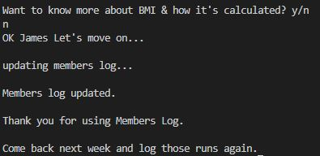

If the User selects "y" the program will display a link that the User can copy and paste which will direct the User to a website with all the details about BMI. Once again the program will update the database and move on, ending with a message thanking the user and asking them to come back the following week to log their runs again.

#### _**Link to Site about BMI**_

The process terminates.

## Future Features

* Add a new feature that will display previous weeks' runs and total distances to returning users.
* Add feature to display previous weeks' BMI rating to returning users.
* Add round up of User BMI rating to 2 decimal points.
* Add validation step to code on line 187 to ensure User only responds with a numeric answer.

## Data-Model

The program is based on messages and questions displayed by the program to the User for information and for the request of Users' input.

The program flows via a series of functions and global variables and based on the User input data which is stored on an external database, in this case Google Spreadsheets is used, the program will provide the User with the relevant output for each feature and the stored information will be used again upon the Users' return the following week to log further runs.

## Flow-Charts

The project was initiated with an idea in mind and a Lucid Chart was used to provide some clarity of the programs features before writing any code.

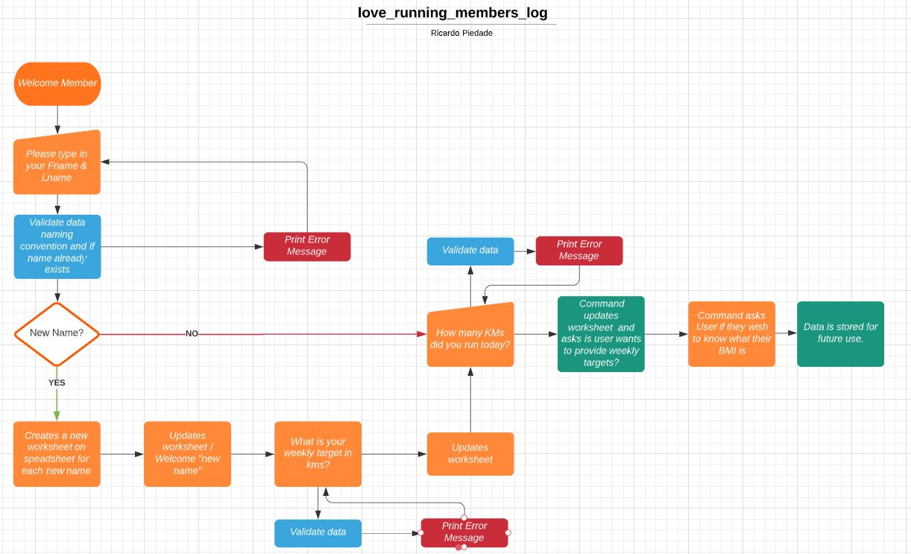

## Testing

The following tests were undertaken to test this program:

* The program starts off with a greeting message and asks the User to provide their first name. Its is expected that the User only provides an alpha response before moving on. This part of the code has been written to only accept such response. Any other type of response will trigger an error message and will prompt the User to try again. The same method has been applied to the User last name prompt. Once the User has responded to both prompts correctly, the program will provide a more personalized greeting which will include the User's first name:

* The program will then ask the User to provide their daily runs in numerical form reminding the User to type "0" if no runs on a particular day. Code has been written to accept only numerical responses but in this case, edge cases have been included so that the program will not accept negative values or excessive distances run on a daily basis. The lowest value accepted is "0" and the maximum daily run accepted is 300.

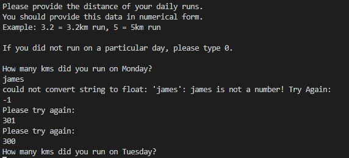

* Once the User has all of the daily distances run, the program will provide the user with a summary of the data entered and then will sum up all the values and provide the User with a total distance run for that week and proceed to logg the data to the gspreadsheet API and inform the User that the runs have been logged.

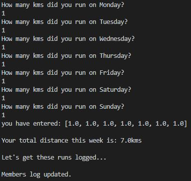

* At this point, the program will ask the User if they would like to provide a weekly distance target for the upcoming week. Code has been written to only accept a "y" or "n" response from the User. Once the User types "y", the program will find the specific User's gspreadsheet and if its the first time the User provides a response to this step, the program by default will respond with a previous target of "None". The code also incorporates an edge case here so as to only accept reasonable responses. The code will not accept negative responses or weekly distances greater than 1000kms per week.

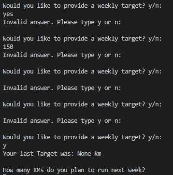

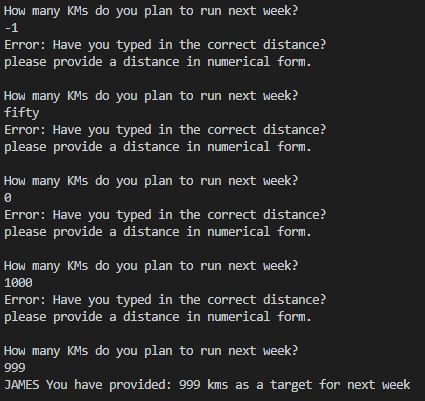

* If its not the first time the User responds to this question, the program will retreive the distance provided by User on the previous week and remind the User of their previous weeks target and display it.

* If the User decides they do not want a weekly target and type "n", the program will move on and display a message statting just that.

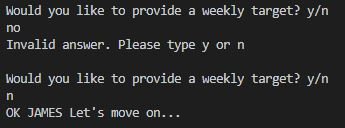

* The following part of the program is about Body Mass Index (BMI) and the program asks the User if they would like to know what their BMI is. Once again code is written to only accept "y" or "n" responses;

* In order to calculate BMI, the program requires height and weight data from the User. Once again code is written to only accept numerical responses and edge cases have also been applied here with the minimum height being 50cm and maximum accepted is 2999cm.

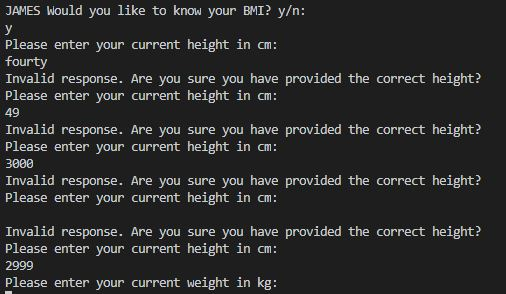

* The program then requires the Users weight and as per the height section, code is written to only accept numerical responses and edge cases have also been applied here with the minimum weight being 2kg and maximum accepted is 699kg.

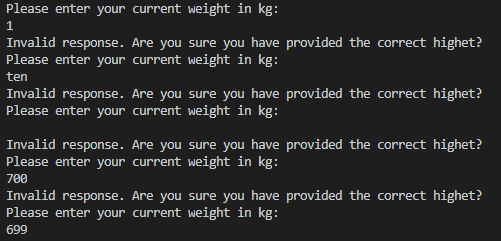

* Once the program has these two datas, it then proceeds to calculate the User's BMI. In the final step the program asks the User if they would like to know more about BMI and how its meassured. Once again code is written to only accept "y" and "n" responses. If the user selects "y" the program displays a link which the User can use to find out more details. Unfortunately Heroku does not support links to external sources so this is not a link that the User can clicked on and be taken to the source automatically.

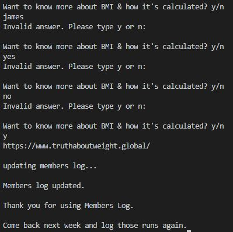

* If the User selects "n" for no, the program will move on and log the final data to the gspreadsheet API, and displays a message to the User to come back again next week and update their runs.

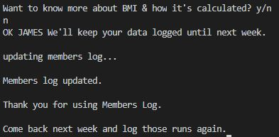

### _**PEP8 Validator Testing**_

* I have passed the code through PEP8 online and although it is showing three errors, these errors considered by Python.Org and PEP Style Guide to be acceptable and best practice as it is more reader friendly.

### _**PEP8 Error is ignored**_

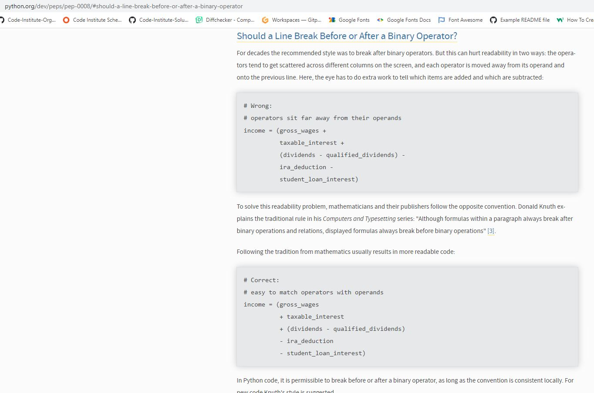

## Bugs

### _**Solved Bugs**_

* When I wrote this code, the program was only accepting integer and float responses from the User when inputting their daily distances. Empty and string responses were breaking the program and the user had to start from scratch. This was fixed by amending the exception error type from typeError to ValueError. An if statement was also introduced to avoid negative value inputs by the user.

* I was also having issues with User first names and last names as my original code was only focussed on the first names to trigger both names to be added to the members details list and a new tab with headers to be created. The code was adjusted so that both first names and last names was a factor in triggering these features. Now the program will not mix existing members with new members of equal fist names or last names.

* Upon on a Users "y" response, I had a feature to open a webbrowser to a site that would give them more information about BMI and how its calculated, however, this feature was only working in the development environment. Heroku application does not support this feature and so it was decided that I would just display a link of a website to the user in the program terminal.

#### _**Remaining Bugs**_

* There is a remaining bug which was detected very late on in the project. A validation step was missed from the code on line 187 asking the User if they'd like to monitor weekly targets. This validation is not in place and therefore allowing the user to submit any type of response. This step has also been included in the Future Features section.

## Deployment

This project was deployed using Code Institute's mock terminal for Heroku.

* Steps for deployment:

  * Create new Heroku app
  * Set the buildbacks to Python and NodeJS in this order
  * Link the Heroku app to the GitHub repository
  * Click on Deploy

## Credits

* Code Institute for the deployment terminal
* www.Lucidchart.com for the lucid chart
* <https://www.truthaboutweight.global/>
* <https://stackoverflow.com/>
* https://www.guinnessworldrecords.com/ (Data for Shortest / Tallest / Heaviest and Lightest humans on record)
